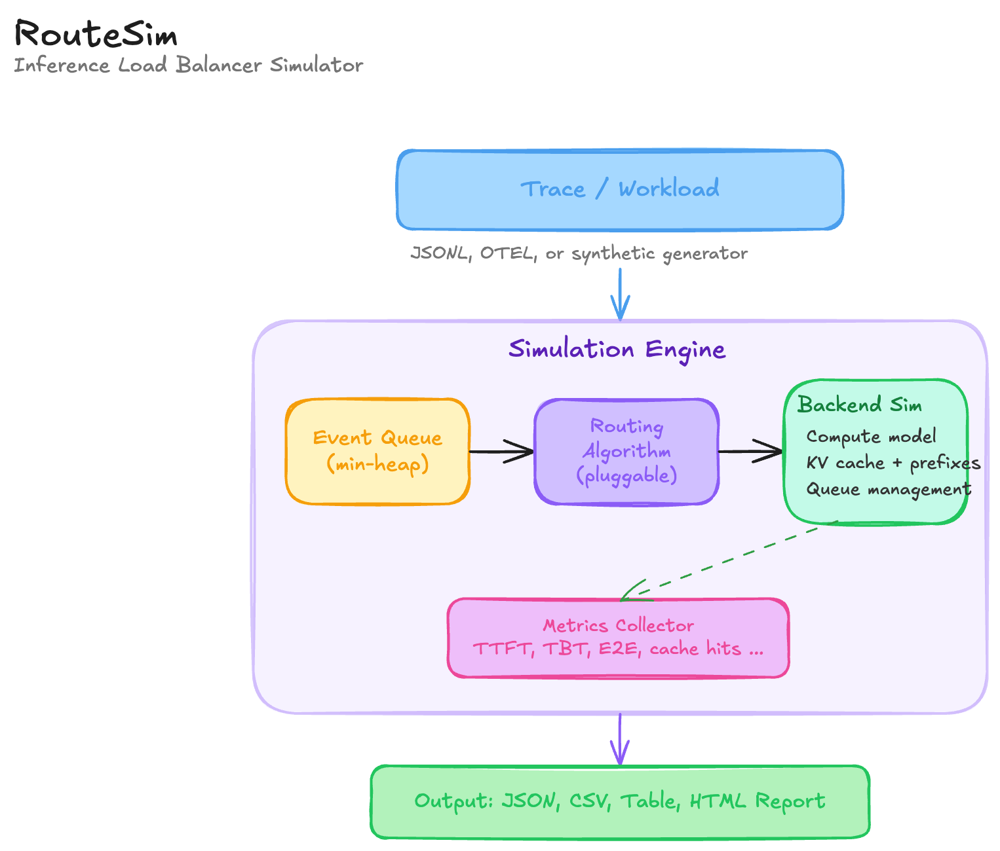

# RouteSim

**Benchmark LLM routing algorithms without GPUs**

[](https://opensource.org/licenses/Apache-2.0)
[](https://www.python.org/downloads/)

RouteSim is a discrete-event simulator for LLM inference load balancing. It lets you replay real or synthetic inference traffic against pluggable routing algorithms and simulated GPU backends — no actual GPUs required.

## Why RouteSim?

Production LLM serving involves routing requests across a fleet of GPU workers, each with its own KV cache state, queue depth, and compute capacity. The choice of routing algorithm directly impacts latency, throughput, cache hit rates, and cost.

Testing routing strategies on real GPU clusters is expensive and slow. RouteSim lets you:

- **Compare algorithms** side-by-side on the same workload
- **Replay production traces** to validate new strategies before deployment
- **Simulate KV cache dynamics** including prefix caching and eviction
- **Model different topologies** including prefill/decode disaggregation
- **Prototype custom algorithms** in Python with a simple API

## Quickstart

```python
import routesim

# Compare routing algorithms on a production cluster config
results = routesim.compare(
    config="configs/production_h100x8.toml",
    trace="traces/example_trace.jsonl",
    algorithms=["round_robin", "least_outstanding", "prefix_aware", "session_affinity"],
)

for r in results:
    print(r.summary())
```

Or use the CLI:

```bash
routesim compare --config configs/production_h100x8.toml \
                 --trace traces/example_trace.jsonl \
                 --algorithms round_robin,least_outstanding,prefix_aware,session_affinity
```

## Architecture



## Built-in Algorithms

| Algorithm | Strategy | Best For | Complexity |
|-----------|----------|----------|------------|
| `round_robin` | Cycle through backends | Uniform workloads, baseline | O(1) |
| `least_outstanding` | Fewest queued + active requests | Variable request sizes | O(n) |
| `least_kv` | Lowest KV cache utilization | Memory-constrained clusters | O(n) |
| `prefix_aware` | Maximize KV cache hits | Shared system prompts | O(n) |
| `session_affinity` | Sticky sessions per conversation | Multi-turn chat | O(1) amortized |
| `cost_escalation` | Dynamic cost model with decay | Complex/mixed workloads | O(n) |

## Write Your Own Algorithm

### Python

```python
import routesim

class MyRouter(routesim.Algorithm):
    def route(self, request, backends, clock_ms):
        # Find backend with highest prefix cache hit probability
        best = max(backends, key=lambda b: (
            request.prefix_hash in b.prefix_hashes_cached,
            -b.queue_depth,
            -b.kv_cache_utilization,
        ))
        return routesim.Route(best.id)
```

### Rust

Implement the `RoutingAlgorithm` trait in `crates/routesim-algorithms/`:

```rust
impl RoutingAlgorithm for MyAlgorithm {
    fn route(&mut self, request: &RequestInfo, backends: &[BackendSnapshot], clock: &dyn Clock) -> RoutingDecision {
        let best = backends.iter()
            .filter(|b| b.state != BackendState::Offline)
            .min_by_key(|b| b.queue_depth)
            .unwrap();
        RoutingDecision::Route(best.id)
    }

    fn name(&self) -> &str { "my_algorithm" }
}
```

See [CONTRIBUTING.md](CONTRIBUTING.md) for details on adding new algorithms.

## Configuration

RouteSim uses TOML configuration files:

```toml
[simulation]
name = "my-experiment"
seed = 42
warmup_requests = 100

[cluster]
gpu_type = "H100Sxm"        # H100Sxm, A100Sxm80, L40S
num_backends = 8
max_batch_tokens = 16384
max_queue_depth = 256
kv_cache_blocks = 32768
kv_block_size = 16

[cluster.compute_model]
prefill_tokens_per_sec = 50000
decode_tokens_per_sec_batch1 = 80
decode_throughput_saturation_batch = 64
decode_tokens_per_sec_saturated = 3200

[trace]
format = "compact_jsonl"
path = "traces/my_trace.jsonl"
```

## CLI Reference

```bash
# Run a single algorithm
routesim run -c config.toml -t trace.jsonl -a prefix_aware

# Compare algorithms
routesim compare -c config.toml -t trace.jsonl -A round_robin,prefix_aware

# Generate synthetic trace
routesim gen-trace --generator poisson --rate 100 --duration 300 -o trace.jsonl

# Sweep request rates
routesim sweep -c config.toml -a prefix_aware --rates 50,100,150,200

# Convert OTEL traces
routesim convert -i otel_traces.json -f otel -o trace.jsonl

# List algorithms
routesim list-algorithms
```

## Metrics

RouteSim reports comprehensive metrics for each simulation:

- **Latency**: P50/P75/P90/P95/P99 TTFT, TBT, end-to-end latency, queue wait
- **Throughput**: Requests/sec, tokens/sec (prompt + generation)
- **Cache**: Global and per-backend prefix cache hit rate, eviction rate
- **Fairness**: Jain's fairness index, coefficient of variation, max/min queue ratio
- **Cost**: GPU-seconds per request, estimated $/1K tokens

## Installation

### From Source

```bash
git clone https://github.com/routesim/routesim.git
cd routesim

# Rust CLI
cargo build --release

# Python package
pip install maturin
maturin develop --release
```

## Related Projects

- [vLLM](https://github.com/vllm-project/vllm) — High-throughput LLM serving engine
- [llm-d](https://github.com/llm-d/llm-d) — Kubernetes-native LLM serving
- [NVIDIA Dynamo](https://github.com/ai-dynamo/dynamo) — GPU-optimized inference framework
- [SGLang](https://github.com/sgl-project/sglang) — Fast structured generation

## License

Apache 2.0 — see [LICENSE](LICENSE) for details.
