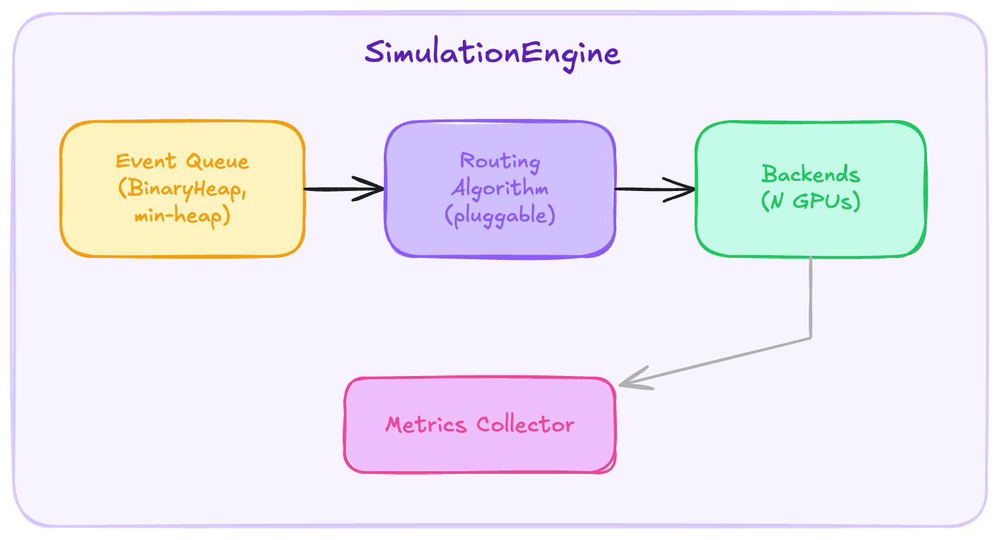

# RouteSim Design Document

This document describes the architecture, design decisions, and internal workings of RouteSim. It's intended for contributors and anyone who wants to understand what's going on under the hood.

## Motivation

I built RouteSim because I wanted a way to benchmark LLM routing algorithms without needing actual GPUs. The core idea is simple: if you can model how GPUs process inference requests (prefill throughput, decode batching, KV cache behavior), you can simulate thousands of requests in seconds and compare routing strategies on realistic workloads.

The existing options were either too simplistic (pure queueing theory models that ignore KV caches) or too heavy (spinning up actual GPU clusters). RouteSim sits in the middle: a realistic discrete-event simulator that models the things that actually matter for routing decisions.

## Architecture Overview



The system is split into three Rust crates:

| Crate | Purpose |
|-------|---------|
| `routesim-core` | Simulation engine, backend model, KV cache, metrics, config, CLI |
| `routesim-algorithms` | `RoutingAlgorithm` trait + built-in algorithm implementations |
| `routesim-python` | PyO3 bindings for the Python API |

The split between `core` and `algorithms` is deliberate. Routing algorithms only see a constrained view of the system (`BackendSnapshot`, `RequestInfo`) and can't reach into engine internals. This makes it easy to add new algorithms without touching the simulator, and impossible for algorithms to accidentally depend on implementation details.

## Discrete-Event Simulation

The engine uses a classic discrete-event simulation pattern. All state changes happen through events processed in chronological order.

### Event Types

```rust
enum SimEvent {
    RequestArrival(InferenceRequest),        // New request enters the system
    PrefillComplete { backend_id, request_id },  // Prefill done, start decode
    TokenGenerated { backend_id, request_id, token_num },  // One decode token produced
    RequestComplete { backend_id, request_id },  // All tokens generated
    BatchSchedule { backend_id },            // Trigger continuous batching
    KvTransferStart { from, to, request_id },    // Disaggregated: start KV transfer
    KvTransferComplete { from, to, request_id }, // Disaggregated: transfer done
    ...
}
```

### Event Loop

The event queue is a `BinaryHeap<TimedEvent>` operating as a min-heap (Rust's `BinaryHeap` is a max-heap, so I flip the `Ord` implementation). Each event carries a timestamp and a sequence counter. The sequence counter breaks ties deterministically -- if two events happen at the same millisecond, the one scheduled first processes first.

The main loop is straightforward:

1. Pop the earliest event
2. Advance the virtual clock to that timestamp
3. Let the routing algorithm observe the event (`on_event`)
4. Process the event (which may schedule new events)
5. Repeat until the queue is empty

There's no wall-clock time involved. The simulation runs as fast as the CPU allows.

### Request Lifecycle

A request goes through these stages:

1. **Arrival** -- The engine calls `algorithm.route()` to pick a backend. The algorithm sees snapshots of all backends and decides where to send the request (or reject it).

2. **Queued** -- The request enters the backend's queue. If the backend is idle, a `BatchSchedule` event fires immediately.

3. **Batch scheduling** -- The backend dequeues requests until the batch token budget is full. For each request, it attempts KV cache allocation. If allocation fails (cache full, eviction unsuccessful), the request is rejected.

4. **Prefill** -- The prefill duration is computed from the compute model: `prefill_ms = (prompt_tokens / prefill_tokens_per_sec) * 1000`. If the request had a prefix cache hit, only the new (non-cached) tokens need prefill.

5. **Decode** -- After prefill completes, tokens are generated one at a time. The inter-token latency depends on the current batch size via the piecewise-linear throughput model. A `TokenGenerated` event fires for each token.

6. **Completion** -- When all tokens are generated, the engine records metrics, releases KV cache blocks, and removes the request from the active batch.

## GPU Compute Model

I wanted a model that's simple enough to reason about but captures the key performance characteristics of real GPU inference.

### Prefill

Prefill is compute-bound and essentially linear in token count:

```
prefill_latency_ms = (tokens / prefill_tokens_per_sec) * 1000
```

For an H100, `prefill_tokens_per_sec` is around 50,000. A 512-token prompt takes ~10ms to prefill.

### Decode (Piecewise-Linear Batching)

Decode throughput scales with batch size, but not linearly. At batch size 1, a single H100 generates about 80 tokens/sec (memory-bandwidth bound). At batch size 64, throughput saturates around 3,200 tokens/sec (compute-bound).

I model this as a linear interpolation between two points:

```
t = (batch_size - 1) / (saturation_batch - 1)
throughput = batch1_rate + t * (saturated_rate - batch1_rate)
```

Then the inter-token latency for the entire batch is:

```
itl_ms = (batch_size / throughput) * 1000
```

This is a simplification -- real throughput curves aren't perfectly linear -- but it captures the essential behavior: small batches are inefficient, larger batches amortize overhead, and there's a point of diminishing returns.

### Dynamic Batching

The simulator models dynamic batching where new requests can join the active batch at scheduling boundaries (when a backend becomes idle, finishes a prefill, or completes a request). A `BatchSchedule` event fires at these points and dequeues waiting requests into the batch up to the token budget. This is simpler than true iteration-level continuous batching (as in vLLM or TGI, where requests can be inserted mid-decode-step), but it captures the key behavior: batches grow and shrink over time as requests arrive and complete.

## KV Cache Simulation

The KV cache model is one of the more detailed parts of the simulator. It matters because KV cache capacity is often the bottleneck in production, and prefix caching is a major optimization that routing algorithms can exploit.

### Block-Based Allocation

Following vLLM's design, the cache is divided into fixed-size blocks (default: 16 tokens per block). When a request arrives, the engine computes how many blocks it needs:

```
blocks_needed = ceil(total_tokens / block_size)
```

Blocks are allocated from a free list. If there aren't enough free blocks, the eviction policy kicks in.

### Prefix Sharing

This is the key optimization for routing. When multiple requests share the same system prompt (identified by `prefix_hash`), their prefix KV blocks can be shared:

- **First request** with a given prefix: Allocates fresh blocks, tags them with the prefix hash, stores them in a `prefix_index`.
- **Subsequent requests** with the same prefix: Finds existing blocks via `prefix_index`, increments their reference count, and only allocates new blocks for the non-prefix portion.

When a request completes, its non-prefix blocks are freed immediately. Prefix blocks are kept alive (with decremented ref counts) so future requests can reuse them. This is why prefix-aware routing works -- by sending requests with the same prefix to the same backend, you get cache hits and skip re-computing the prefix KV.

### LRU Eviction

When the cache is full and allocation fails, the eviction policy runs:

1. **First pass**: Evict non-prefix blocks with ref_count = 0 (cheapest to evict, nobody is using them).
2. **Second pass**: If still not enough space, evict prefix blocks with ref_count = 0 (these are retained for future reuse but can be sacrificed).

Blocks are evicted in LRU order, tracked by a `VecDeque`. Every time a block is accessed, it moves to the end of the queue.

If eviction still can't free enough blocks, the allocation fails and the request is rejected.

## Routing Algorithm Interface

Algorithms implement this trait:

```rust
trait RoutingAlgorithm {
    fn route(
        &mut self,
        request: &RequestInfo,
        backends: &[BackendSnapshot],
        clock: &dyn Clock,
    ) -> RoutingDecision;

    fn on_event(&mut self, event: &SimEventInfo, backends: &[BackendSnapshot]) { }
    fn name(&self) -> &str;
    fn custom_metrics(&self) -> HashMap<String, f64> { HashMap::new() }
}
```

### What algorithms can see

Algorithms receive `BackendSnapshot` structs with:
- Queue depth and active batch size/tokens
- KV cache utilization (0.0 to 1.0)
- Set of prefix hashes currently cached
- Estimated TTFT and current tokens/sec
- Backend role (prefill/decode/both) and state (idle/processing/draining/offline)
- Historical counters (total requests served, total tokens generated)

This is intentionally a read-only, limited view. Algorithms can't see individual requests in the queue or manipulate backend state directly.

### Routing decisions

```rust
enum RoutingDecision {
    Route(backend_id),                          // Send to this backend
    RouteWithPriority(backend_id, priority),    // Send with priority hint
    Reject,                                     // Drop the request
    RouteDisaggregated { prefill, decode },     // Split prefill/decode
}
```

### Event observation

`on_event()` fires after every simulation event. Algorithms can use this to maintain internal state -- for example, `CostEscalation` tracks per-backend costs with exponential decay, and `SessionAffinity` maintains a conversation-to-backend mapping.

### Type bridge

The core engine and algorithm crate have parallel type hierarchies (`core::BackendSnapshot` vs `algorithms::BackendSnapshot`, etc.). Conversion functions (`to_algo_snapshot`, `to_algo_request`, `to_algo_event`) bridge between them. This is a bit verbose but keeps the crates truly independent -- you can change how the engine represents backends without touching any algorithm code.

## Built-in Algorithms

| Algorithm | Strategy | Complexity |
|-----------|----------|------------|
| `round_robin` | Cycle through backends | O(n) |
| `least_outstanding` | Pick backend with fewest queued + active requests | O(n) |
| `least_kv` | Pick backend with lowest KV cache utilization | O(n) |
| `prefix_aware` | Weighted score: cache hit bonus + load balance penalty | O(n) |
| `session_affinity` | Sticky sessions per conversation ID | O(1) amortized |
| `cost_escalation` | Dynamic cost model with exponential decay | O(n) |
| `prefix_overlap` | Block-level KV cache overlap scoring | O(n*b) |

### prefix_aware

This is probably the most interesting one. It scores each backend as:

```
score = cache_weight * has_prefix + (1 - cache_weight) * load_score
```

Where `has_prefix` is 1 if the backend has the request's prefix cached (checked via `prefix_hashes_cached`), and `load_score` is an inverse of the backend's load. The trade-off is cache locality vs. load balance.

### cost_escalation

Each backend accumulates a cost when it receives a request. Costs decay exponentially over time. The algorithm always picks the backend with the lowest current cost. This naturally distributes load while being responsive to bursts -- a backend that just received many requests will have high cost and be avoided.

### prefix_overlap

This algorithm exploits block-level KV cache hashes from Mooncake production traces (and any system that uses content-addressed block caching, like SGLang's RadixAttention). Instead of checking a single prefix hash, it computes the overlap between the request's `cache_block_hashes` and each backend's `cached_block_hashes`:

```
cache_score = |request.blocks ∩ backend.cached_blocks| / |request.blocks|
load_score  = 1 - (queue_depth + active_batch) / max_queue_depth
score       = cache_weight * cache_score + (1 - cache_weight) * load_score
```

The default `cache_weight` is 0.7. A circuit breaker ignores cache affinity when a backend exceeds 90% load, preventing cache-hot backends from becoming overwhelmed. When the request has no block hashes, it falls back to least-outstanding.

The complexity is O(n*b) where n is the number of backends and b is the number of blocks per request, since computing the overlap requires checking each block against the backend's hash set.

## Metrics

### Collection

`MetricsCollector` records a `RequestMetric` for every completed request:
- Timing: queue wait, TTFT, total latency
- Tokens: prompt count, generated count
- Cache: whether this request got a prefix cache hit
- TBT samples: inter-token latencies

### Warmup

The first `warmup_requests` records are excluded from aggregation. This is important because the simulator starts with empty caches and empty queues, which isn't representative of steady-state behavior. In practice, I set warmup to 50-100 for benchmarks.

### Aggregation

`MetricsCollector::aggregate()` computes:

**Latency percentiles** (p50, p75, p90, p95, p99, min, max, mean) for TTFT, TBT, E2E, and queue wait. Computed by sorting and indexing.

**Throughput**: requests/sec and tokens/sec, computed from the time span of the post-warmup records.

**Cache hit rate**: Simple ratio of requests with `prefix_cache_hit = true` over total.

**Fairness**:
- **Coefficient of Variation** = `std(per_backend_requests) / mean(per_backend_requests)`. Zero means perfectly balanced.
- **Jain's Fairness Index** = `(sum(x_i))^2 / (n * sum(x_i^2))`. Ranges from 1/n (one backend does all the work) to 1.0 (perfectly fair).

**Cost**:
- GPU-seconds per request = total GPU busy time / completed requests
- Estimated $/1K tokens, based on per-GPU hourly pricing from the `GpuProfile`.

## Disaggregated Serving

RouteSim supports prefill/decode disaggregation, where some backends only handle prefill and others only handle decode. This models architectures like Splitwise or DistServe.

When enabled:
1. The routing algorithm returns `RouteDisaggregated { prefill, decode }`
2. The request is sent to the prefill backend
3. After prefill completes, a `KvTransferStart` event fires
4. Transfer time is modeled based on KV size and interconnect bandwidth:
   ```
   bytes_per_token = 2 (K+V) * 2 (bytes/fp16) * num_kv_heads * head_dim * num_layers
   bytes = num_tokens * bytes_per_token
   transfer_us = latency_us + bytes / bandwidth_bytes_per_us
   ```
5. After transfer, the request enters the decode backend's batch

The transfer model assumes a fast interconnect (default: 500us latency, 50 GB/s bandwidth, modeling NVLink). You can tune these parameters in the `[cluster.disaggregated]` config section.

## Configuration Design

I chose TOML because it's readable and well-supported in Rust. The config structure mirrors the simulation's logical components:

- `[simulation]` -- meta parameters (name, seed, warmup)
- `[cluster]` -- hardware (GPU type, count, batch limits, KV cache)
- `[cluster.compute_model]` -- throughput characteristics
- `[cluster.disaggregated]` -- optional prefill/decode split
- `[trace]` -- input workload source and format

Validation happens at parse time. If you set `disaggregated.enabled = true` but `prefill_backends + decode_backends != num_backends`, it fails immediately with a clear error.

### GPU Profiles

Rather than having users specify raw FLOPS numbers, I provide named profiles:

| Profile | HBM | Bandwidth | FP16 TFLOPS | $/hour |
|---------|-----|-----------|-------------|--------|
| H100 SXM | 80 GB | 3.35 TB/s | 989 | $3.50 |
| A100 SXM 80GB | 80 GB | 2.0 TB/s | 312 | $2.00 |
| L40S | 48 GB | 0.864 TB/s | 362 | $1.00 |

These are used for cost estimates. The actual throughput behavior comes from the `[cluster.compute_model]` section, which you can tune independently of the GPU profile.

## Reproducibility

Every simulation run is deterministic given the same config and trace. There's no wall-clock time dependency -- the virtual clock advances only through events. The RNG seed controls synthetic trace generation. Sequence counters on events guarantee stable ordering when multiple events share a timestamp.

This means you can:
- Re-run the same experiment and get identical results
- Change one variable (e.g., the algorithm) and know the difference is due to that change alone
- Share configs and traces for reproducible benchmarks

## Workspace and Build

The workspace uses Cargo's workspace feature with three crate members. `routesim-python` is excluded from `default-members` because it requires a Python interpreter to build (via PyO3/maturin). The CI runs Rust tests with `--exclude routesim-python` and builds Python separately with maturin.

Release builds enable LTO and single codegen unit for maximum performance. The simulator processes events very quickly (~1M events/sec on a modern CPU), so even large traces complete in seconds.

## Trade-offs and Limitations

**What's modeled well:**
- Request queueing and scheduling
- KV cache capacity and prefix reuse
- Batch size effects on throughput
- Prefill/decode latency
- Load balancing fairness
- Disaggregated topology

**What's simplified:**
- The piecewise-linear throughput model is an approximation. Real GPUs have more complex scaling curves.
- TBT is computed from per-token timestamps, so it reflects real batch-size variation within a request. However, the compute model's throughput curve is a piecewise-linear approximation, so token-to-token latency may differ from real hardware.
- Network latency between the load balancer and backends is not modeled (assumed negligible for datacenter deployments).
- Memory fragmentation beyond block-level granularity is not simulated.
- Model weights, LoRA adapters, and multi-model serving are represented structurally but the compute impact of adapter switching isn't modeled in detail.

These simplifications are intentional. The goal is to capture the factors that actually differ between routing algorithms, not to build a cycle-accurate GPU simulator.
